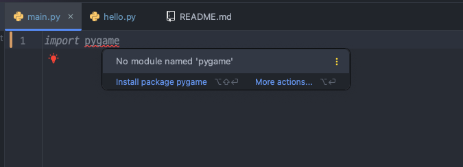
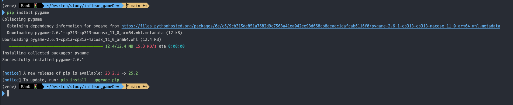
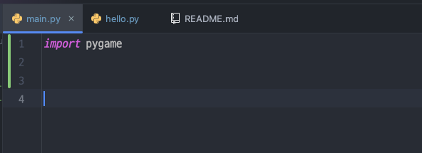
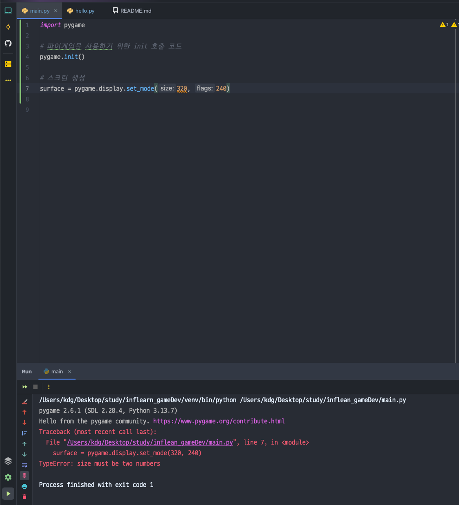
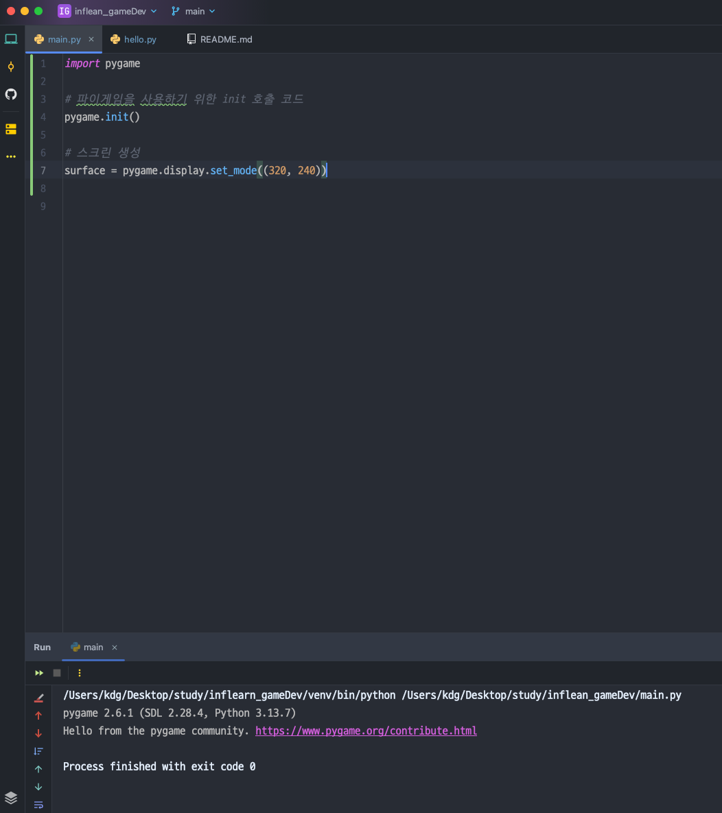
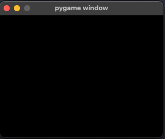
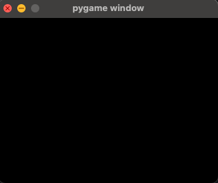

# ️Pygame 기본 구조

---
1. 파이게임을 사용하기 위해 `import pygame` 으로 선언

    ```python
    import pygame
    ```

   - 하지만 파이게임 라이브러리를 설치하지 않았다면 `import` 에러가 발생하므로  
   미리 아래 명령어로 설치해야 한다.

    ```bash
    pip install pygame
    ```
    

   - 설정이 완료 되면 다음과 같은 이미지가 나온다.
   
   
   - 위의 화면이 떴다면 `pygame` 라이브러리가 들어온것을 확인 할 수 있다.
     

2. 파이게임 라이브러리 초기화

    ```python
    import pygame
   # 파이게임 라이브러리 초기화
    pygame.init()
    ```

3. 게임 화면 및 프레임 설정
   - 임의로 `320, 240`의 게임 화면을 생성한다.
   ```python
   import pygame

   # 파이게임 라이브러리 초기화
   pygame.init()

   # 320x240 크기의 윈도우(게임 화면) 생성
   surface = pygame.display.set_mode(320, 240)
   
   # FPS(초당 프레임 수)를 관리하기 위한 Clock 객체 생성
   fps = pygame.time.Clock()
   ```
   > 이렇게 설정했더니 다음과 같이 에러 표시가 난다.

   > 이유를 알아보니 튜플을 해주지 않아서 이런 에러가 난 것이다.
   > 
   ```python
   import pygame

   # 파이게임 라이브러리 초기화
   pygame.init()

   # 320x240 크기의 윈도우(게임 화면) 생성
   surface = pygame.display.set_mode((320, 240))
   ```
   > 위와 같이 튜플 설정을 해주니 에러가 풀렸다.
   
   > 

> 튜플이란?
> 
> 리스트와 동일하게 여러 객체를 모아서 담는다. 숫자, 문자, 객체, 배열, 튜플 안의 튜플 전부 가능하다. `하지만 튜플 내의 값은 수정이 불가하다`. `추가도, 삭제도 안 된다`. 한번 만들어지면 끝까지 가지고 가야 된다. ( )로 사용하고, ( )가 없어도 동일하게 사용 가능하다.


4. 게임 루프 시작
   - 게임을 실행하며 세부적인 부분을 설정한다.
   ```python
   # 게임 루프 시작
   while running:
      # 매 프레임마다 이벤트를 확인
      for event in pygame.event.get():
      # 창의 닫기 버튼(X)을 눌렀을 때 실행 종료
         if event.type == pygame.QUIT:
         running = False

       # 화면 전체를 색상 선택 (RGB)
       surface.fill((0, 0, 0))
   
       # 화면 업데이트
       pygame.display.flip()
   
       # 초당 60프레임 속도 제한
       fps.tick(60)

   # 게임 루프가 끝나면 pygame 종료
   pygame.quit()
   
   # 시스템 종료
   sys.exit()
   ```
   
> `running = False`시 x 버튼을 누르면 화면이 종료되고, `True`시 화면이 꺼지지 않는다!!!

- x를 눌렀을때 꺼지지 않음



- x를 눌렀을때 꺼짐

